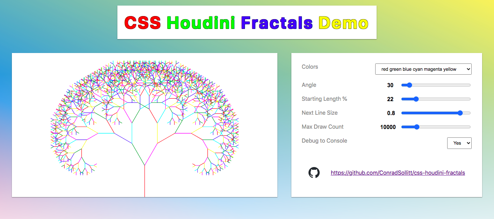
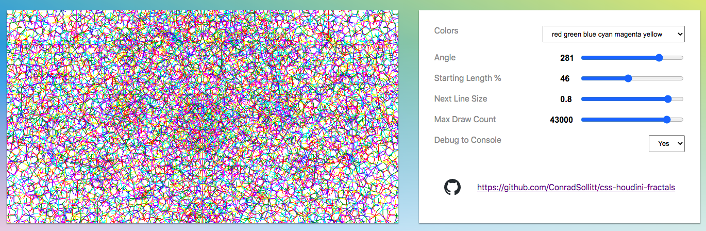
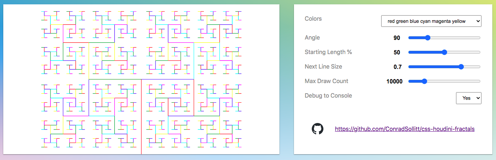
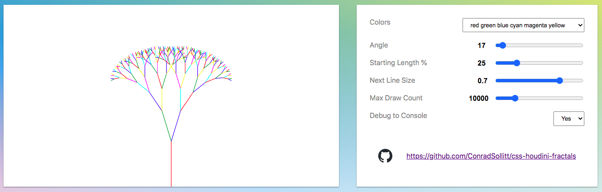

# CSS Houdini Fractals

Drawing Fractals with CSS Houdini.

This demo was created for https://github.com/GoogleChromeLabs/houdini.how and can be also previewed on the main Chrome Labs site https://houdini.how/

**From:** https://developer.mozilla.org/en-US/docs/Web/Houdini
> Houdini is a set of low-level APIs that exposes parts of the CSS engine, giving developers the power to extend CSS by hooking into the styling and layout process of a browser’s rendering engine.

## 🌐 Try it online!

https://conradsollitt.github.io/css-houdini-fractals/

## 🚀 Download locally

This repository has zero dependencies. Only the [fractals.js](fractals.js) file is required to use it with any site. If you would like to try the demo locally download this repository and follow the commands below.

```bash
# If you have node installed:
npm start

# If you do not have node installed and have Python installed then depending on
# the version Python and OS installed one of the following commands should work:
python3 -m http.server
python -m http.server
python -m SimpleHTTPServer
```









## 💡 Usage

### Use CSS Houdini API to import the [fractals.js](fractals.js) file

```js
// Modern Browsers - Import JavaScript file from CDN
if ('paintWorklet' in CSS) {
    CSS.paintWorklet.addModule('https://unpkg.com/css-houdini-fractals@1.1.0/fractals.js');
}

// Modern Browsers - Using Local build, only a single file is needed
if ('paintWorklet' in CSS) {
    CSS.paintWorklet.addModule('fractals.js');
}
```

### Use the [css-paint-polyfill] Polyfill to support all Modern Browsers (won't work with IE)

https://github.com/GoogleChromeLabs/css-paint-polyfill

```html
<script type="module">
    (async function () {
        if (CSS['paintWorklet'] === undefined) {
            await import('https://unpkg.com/css-paint-polyfill');
        }
        CSS.paintWorklet.addModule('fractals.js');
    })();
</script>
```

### HTML

The type of HTML element and class name does not matter, rather height and width are needed.

```html
<style>
    .fractals { height:400px; width:400px; }
</style>
<div class="fractals"></div>
<section class="fractals"></section>
```

### CSS Options

```css
/*
    By default only `background-image: paint(fractals)` is needed.
*/
.fractals {
    background-image: paint(fractals);
}

/*
    The example below shows all options with default values, except
    for [--colors] which is empty resulting in black lines.

    [--colors] are dynamic and based on the number of colors included.
    The delimiter for [--colors] is a space so these examples are all valid:
        --colors: red green blue;
        --colors: black;
        --colors: #000 #222 #444 #666 #888 #aaa #ccc;

    [--shape] = One of [line, circle, square]
    [--debug-to-console] and [-show-origin] = 0 or 1
*/
.fractals {
    --colors: red green blue cyan magenta yellow;
    --angle: 30;
    --starting-length-percent: 22;
    --next-line-size: 0.8;
    --shape: line;
    --max-draw-count: 10000;
    --debug-to-console: 0;
    --show-origin: 0;
    background-image: paint(fractals);
}
```

## 🎨 CSS Houdini Links

* https://houdini.how/
* https://github.com/GoogleChromeLabs/houdini.how
* https://developer.mozilla.org/en-US/docs/Web/Houdini

## ❄️ Fractals

* https://fractalfoundation.org/resources/what-are-fractals/
* https://en.wikipedia.org/wiki/
* https://mathworld.wolfram.com/Fractal.html
* https://www.wired.com/2010/09/fractal-patterns-in-nature/

## 🌐 Additional JavaScript Fractal Links
* https://thefractal.zone/
* https://github.com/delimitry/fractals-js
* https://progur.com/2017/02/create-mandelbrot-fractal-javascript.html
* https://medium.com/@yortuc/fractal-fun-with-javascript-2102d03ad22b
* https://progur.com/2016/10/procedural-generation-create-fractal-trees-javascript.html
* https://lautarolobo.xyz/blog/use-javascript-and-html5-to-code-a-fractal-tree/
* https://www.lesscake.com/fractals-chaos-game
* https://repl.it/talk/learn/Julia-Fractals-in-JavaScript/12806
* http://rectangleworld.com/blog/archives/462
* http://slicker.me/fractals/animate.htm

## 📝 License

[](https://creativecommons.org/publicdomain/zero/1.0/)
