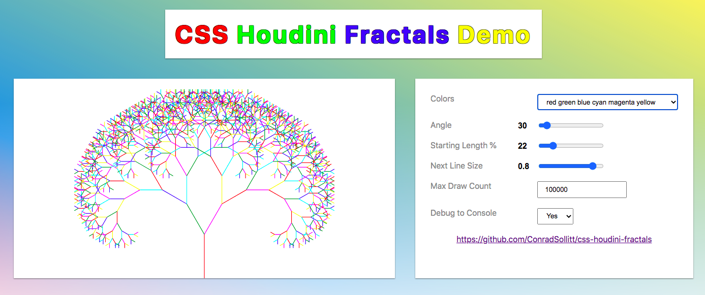

# CSS Houdini Fractals

Drawing Fractals with CSS Houdini. 

This repository has zero dependencies. Only the [fractals.js](fractals.js) file is required us it. If you would like to try the demo locally download this repository and follow the commands below.

```bash
# If you have node installed:
npm start

# If you do not have node installed and have python installed
# then depending on the version Python installed and the OS
# one of the following commands should work:
python3 -m http.server
python -m http.server
python -m SimpleHTTPServer
```



## Usage

The type HTML element does not matter, rather a height and width are needed.

```html
<style>
    .fractals { height:400px; width:400px; }
</style>
<div class="fractals"></div>
<section class="fractals"></section>
```

```css
/*
    By default only `background-image: paint(fractals)` is needed.

    The example below shows all options with default values, except for:
        --colors: {Not set}
        --debug-to-console: 0

    [--colors] are dynamic and based on the number of colors included.
*/
.fractals {
    /* --colors: red green blue; */
    --colors: red green blue cyan magenta yellow;
    --angle: 30;
    --starting-length-percent: 22; 
    --next-line-size: 0.8;
    --max-draw-count: 100000;
    --debug-to-console: 1;
	background-image: paint(fractals);
}
```

## CSS Houdini Links

* https://houdini.how/
* https://github.com/GoogleChromeLabs/houdini.how
* https://developer.mozilla.org/en-US/docs/Web/Houdini

## Fractals

* https://fractalfoundation.org/resources/what-are-fractals/
* https://en.wikipedia.org/wiki/
* https://mathworld.wolfram.com/Fractal.html
* https://www.wired.com/2010/09/fractal-patterns-in-nature/

# License

[](https://creativecommons.org/publicdomain/zero/1.0/)
